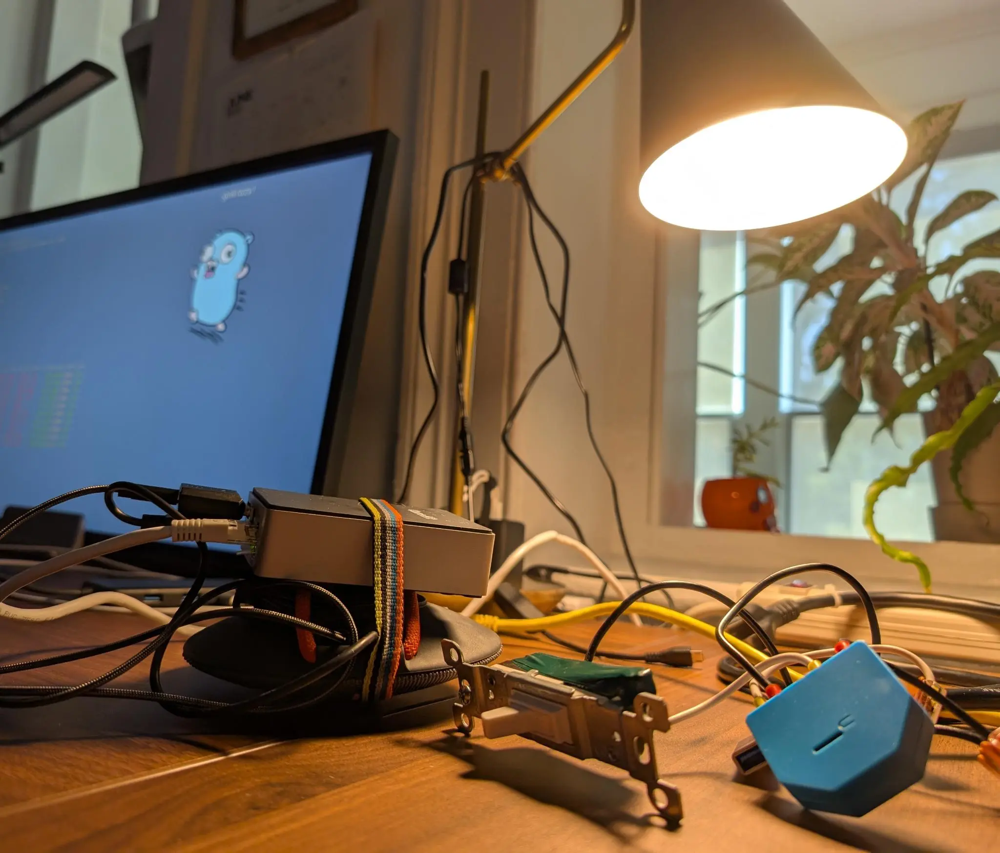

# The Relax Switch

The Relax Switch is a fun little device that plays [pure
moods](https://en.wikipedia.org/wiki/Pure_Moods) when someone turns on a light
switch—perfect for surprising your guests when they walk into the bathroom. 

You can run this however you want but using
[gokrazy](https://gokrazy.org/quickstart/) is the recommended way.

More details in the [blog post](https://drio.sh/posts/relaxswitch-gokrazy).

